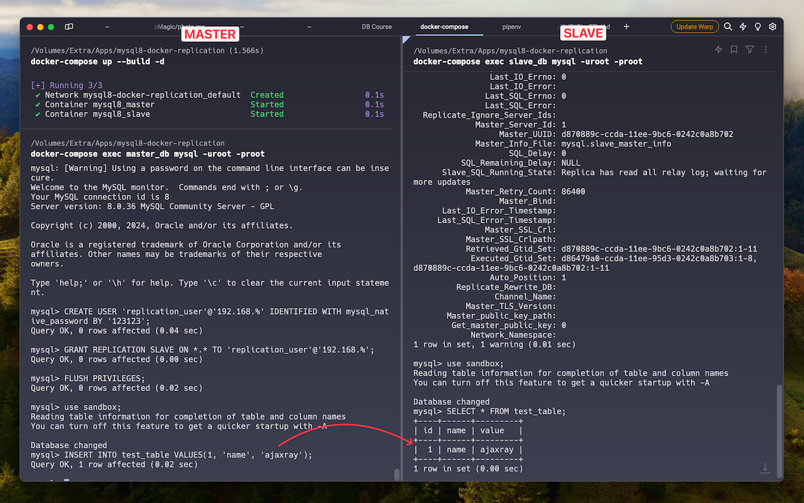

# Testing MySQL 8 GTID Based Replication 

The docker-compose configuration will create 2 containers of MySQL 8 server. 
They are configured properly for testing MySQL 8 GTID based Master-Slave replication.

Following the steps listed below, you can configure and experience replication feature in 5 minutes!

<a href="./screenshot.png" target="_blank">
    
</a>

---

> ⚠️ **Assumptions**:  
> - Assuming you have both Docker Engine and Docker Compose installed and configured. 
> - Assuming you have a basic understanding of Docker and MySQL. 

## Step 1: Start the containers

Clone the repo, enter into directory, and start the containers.
```shell
git clone git@github.com:ajaxray/mysql8-replication.git
cd mysql8-replication
docker-compose up --build -d
```

## Step 2: Create a user for replication

Log into the master databases

```shell
docker-compose exec master_db mysql -uroot -proot
```

And create a user with replication permission

```sql
CREATE USER 'replication_user'@'192.168.%' IDENTIFIED WITH mysql_native_password BY '123123';
GRANT REPLICATION SLAVE ON *.* TO 'replication_user'@'192.168.%';
FLUSH PRIVILEGES;
```

## Step 3: Start replication from the slave

Log into the slave databases (from a different shell window)

```shell
docker-compose exec slave_db mysql -uroot -proot
```

Then, configure the source and start replication.

```sql
CHANGE REPLICATION SOURCE TO SOURCE_HOST='master_db', SOURCE_USER='replication_user', SOURCE_PASSWORD='123123', SOURCE_AUTO_POSITION=1;
START REPLICA;
```

## Step 4: Verify

Add some database, tables, records in the master_db and check if it's available in the slave_db. 
You may use `sandbox` database and `test_table` table that was prepared automatically 
at the time of starting the containers. For example - 
```sql
USE sandbox;
INSERT INTO test_table VALUES(1, 'name', 'ajaxray');
SELECT * FROM test_table;
```
And then, try selecting the record from the slave_db. (Don't insert from slave!)

If you don't see the changes are replicating as expected, run the following SQL command in slave_db.
```sql
SHOW SLAVE STATUS\G
```
And, check the following information for any potential error:

- Last_IO_Errno
- Last_IO_Error
- Last_SQL_Errno
- Last_SQL_Error

## Step 5: Cleanup

Exit from both of the containers using `exit`.  
Then execute the `cleanup.sh` to stop the containers and remove all data and log files.

```shell
chmod +x ./cleanup.sh && ./cleanup.sh
```

This cleanup script will remove all the data and log files along with the containers. 
If you want to keep current data and just to stop the containers, you can just use
```shell
docker-compose down
```

## Contribution guide

Feel free to submit an issue if you face any error. 
Suggestions/PRs are most welcome! 🤗

---
> "This is the Book about which there is no doubt, a guidance for those conscious of Allah" - [Al-Quran](http://quran.com)
